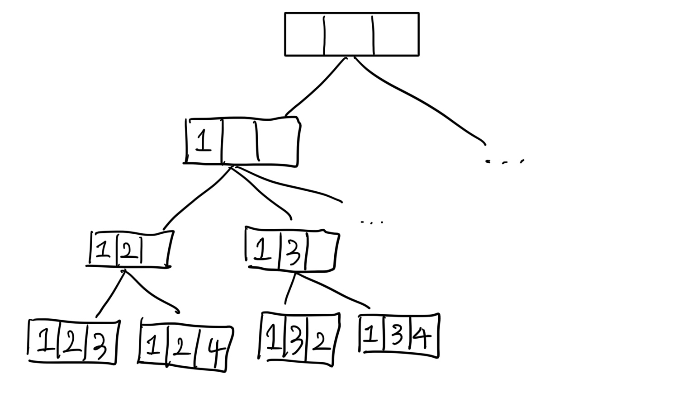
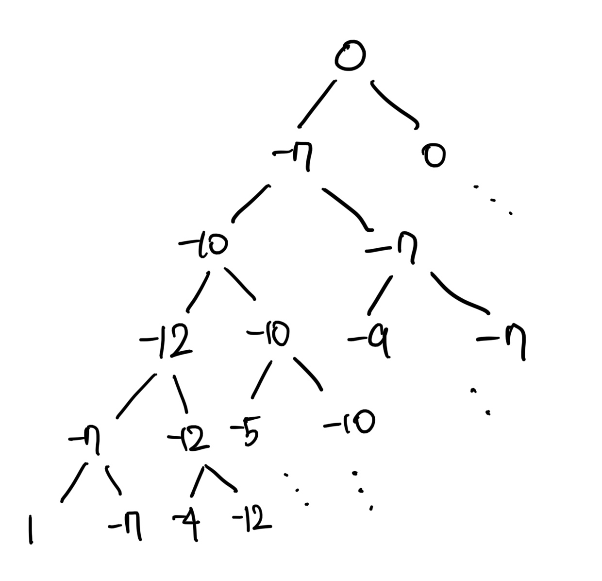

# 백트래킹(backtracking)

- 현재 상태에서 가능한 모든 후보군을 따라 들어가며 탐색하는 알고리즘
- 해(정답)을 찾는 도중 해가 아니어서 막히면, 되돌아가서 다시 해를 찾아가는 기법
- 최적화 문제와 결정 문제를 푸는 방법이 된다


</br>

## 백트래킹 구현하기
- 백트래킹의 주요 개념은 해를 얻을 때까지(주어진 조건을 만족할 때까지) 모든 가능성을 시도한다는 것
- 모든 가능성은 하나의 트리처럼 구성할 수 있으며, 트리의 가지 중 해결책이 존재한다.
- 트리를 검사하기 위해 깊이 우선 탐색(DFS)를 시도 -> 탐색 중 오답을 만나면 이전 분기점으로 돌아간다 -> 시도해 보지 않은 해결책이 있으면 시도 -> 해결 방법이 없다면 더 이전의 분기점으로 돌아간다 -> 모든 트리의 노드를 검사해도 답을 찾지 못할 경우, 해당 문제의 해는 없다
  
### 백트래킹과 재귀
- 백트래킹은 보통 재귀함수로 구현
- 하나 이상의 매개변수를 재귀의 탈출 조건으로 사용한다


</br>

### 백트래킹과 DFS
- DFS는 현재 지점에서 방문할 곳이 있으면 재귀 호출을 이용해 계속해서 이동, 가능한 모든 경로를 탐색한다. 불필요할 것 같은 경로를 사전에 차단할 수 없음 => 경우의 수를 줄이지는 못한다
- 백트래킹은 해를 찾아가는 도중 해당 경로가 해가 될 것 같지 않으면 더이상 가지 않고 되돌아갈 수 있음 
  - 이를 **가지치기(Pruning)** 라고 하며 불필요한 부분을 쳐내고 최대한 올바른 쪽으로 간다
  - 답이 될 만한지 판단 후 그렇지 않으면 이 후를 탐색하지 않고 가지치기하는 것이 백트래킹
    - DFS로 모든 경우의 수를 탐색하는 과정에서, 조건문 등을 걸어 답이 될 수 없는 상황을 정의하고, 그러한 상황일 경우에는 탐색을 중지시킨 뒤 그 이전으로 돌아가서 다시 다른 경우를 탐색하게끔 구현이 가능

</br>

## 관련 문제

1. N과 M (1) ~ (12) [N과 M(1)](https://www.acmicpc.net/problem/15649)

- 비어있는 리스트에서 시작해 수를 하나씩 추가해가며 길이가 M인 수열이 완성되면 출력하는 방식으로 구현



```java
static int[10] arr; //수열을 담는 배열
static boolean[10] isused;  //특정 수가 쓰였는지를 확인

static void func(int k) {
  //현재 k개까지 수를 택한 상황에서 arr[k]를 정하는 함수
  
  if(k==m) {  //재귀함수의 base condition => M개 수를 선택하면 수열을 출력한 후 함수를 종료
    for(int i=0;i<m;i++) {
      system.out.print(arr[i] + " ");
    }
    system.out.println();
    return;
  }

  //1부터 n까지 수를 차례로 확인하며 쓰이지 않은 수 찾기
  for(int i=1;i<=n;i++) {
    if(used[i]) continue;
    arr[k] = i;
    isused[i] = true;
    func(k+1);

    isused[i] = false;
  }
}
```

</br>


2. N-Queen [N-Queen](https://www.acmicpc.net/workbook/view/7315)

  - N x N 체스판에 퀸 N개를 서로 공격하지 못하는 위치에 놓는 경우의 수를 구하는 문제
  - 문제의 N이 14이하로 작기 때문에 백트래킹으로 해결이 가능하다
  - 위의 func(k)함수를 k번째 행에 퀸을 배치하고 k+1번째 행에 퀸을 놓을 함수(func(k+1))를 호출하며 진행
  - k행의 i열에 퀸을 놓을 수 있는지 없는지의 추가적인 조건을 확인하며 해당 경로(가지)가 해가 될 수 있는지 판단한다

</br>


3. 부분수열의 합 [부분수열의 합](https://www.acmicpc.net/problem/1182)

  - N개의 정수의 수열을 입력으로 받고, 그 수열의 크기가 양수인(크기가 1개 이상인) 부분 수열 중 합이 S가 되는 경우의 수를 구하는 문제
  - 입력받은 수열의 맨 앞에서부터 각 수를 더할지 말지를 고려하는 함수를 작성할 수 있다(모든 부분수열의 합 상태 공간 트리)
  - func(cur, tot) => cur은 더할지 말지를 결정할 수의 인덱스, tot은 현재 부분수열의 총 합
    - 재귀를 사용하여 현재 보고있는 수를 현재 총합에 더할지 말지 결정하며 진행한다

