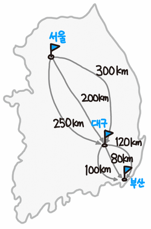
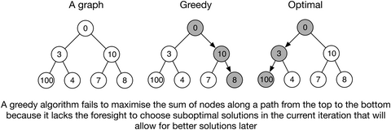

## Greedy Algorithm

### 개념
탐욕 알고리즘은 최적해를 구하는 데에 사용되는 근사적인 방법으로, 여러 경우 중 하나를 결정해야 할 때마다 그 순간에 최적이라고 생각되는 것을 선택해 나가는 방식으로 진행하여 최종적인 해답에 도달한다.

### 조건
탐욕스런 선택 조건은 앞의 선택이 이후의 선택에 영향을 주지 않는다는 것이며, 최적 부분 구조 조건은 문제에 대한 최적해가 부분문제에 대해서도 역시 최적해라는 것이다.

### good case

가장 단 기간에 서울애서 부산까지 도착하는 거리를 구하려면 그 순간 순간 가장 빠른 최단 경로를 구하면 된다. 
즉, 서울에서 대구까지의 최적의 거리, 대구에서 부산까지의 최적의 거리를 구하는 것이 그리디 알고리즘이라고 할 수 있다.

### bad case

이전에 선택한 것이 다음 선택에 영향을 미치므로, greedy algorithm을 사용하지 말아야 한다.

### 관련 문제

https://www.acmicpc.net/problem/5585
~~~
#include <iostream>
using namespace std;
int main()
{
	int m;
	int total=0;
	cin>>m;
	m=1000-m;
	if(m>=500){
		total=m/500;
		m=m%500;
	}
	if(m>=100){
		total+=m/100;
		m=m%100;
	}
	if(m>=50){
		total+=m/50;
		m=m%50;
	}
	if(m>=10){
		total+=m/10;
		m=m%10;
	}
	if(m>=5){
		total+=m/5;
		m=m%5;
	}
	if(m>=1){
		total+=m;
	}
	cout<<total;
}
~~~

https://www.acmicpc.net/problem/1931

~~~
#include <cstdio>
#include <vector>
#include <algorithm>
using namespace std;
 
struct meeting{
    int start,end;
};
 
int cmp(const meeting &a, const meeting &b){
    if(a.end == b.end)
        return a.start < b.start;
    return a.end < b.end;
}
 
int main() {
    int n,i,s,e,last=-1,c=0;
    meeting t;
    vector<meeting> v;
    scanf("%d",&n);
    for(i=0;i<n;i++){
        scanf("%d%d",&s,&e);
        t.start = s;
        t.end = e;
        v.push_back(t);
    }
    sort(v.begin(),v.end(),cmp);
    for(i=0;i<n;i++){
        if(v[i].start >= last){
            last = v[i].end;
            c++;
        }
    }
    printf("%d",c);
    return 0;
}
~~~

