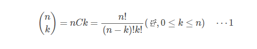

## 정수론 (Number Theory)

>  최대공약수 / 최소공배수


- 최대공약수

  **유클리드 호제법**(互除法, Euclidean algorithm) 은 2개의 자연수의 최대공약수를 구하는 알고리즘의 하나이다. **호제법**이란 말은 두 수가 서로(互) 상대방 수를 나누어(除)서 결국 원하는 수를 얻는 알고리즘을 나타낸다.

```java
// 최대공약수 gcd(Greatest Common Divider)
public static int gcd(a, b) {
    if (a % b == 0) return b;
    return gcd(b, a % b);
}
```

- 최소공배수

  둘 중 한 개의 수를 최대공약수로 나누고 나머지 하나의 수와 곱하면 최소공배수를 구할 수 있다.

  ```java
  // 최소공배수 lcm(Least Common Multiple)
  public static int lcm(a, b) {
      return a / gcd(a, b) * b;
  }
  ```

  

## 조합론 (Combinatorics)

> 이항계수

- 이항계수(Binomial Coefficient)는 주어진 크기 집합(n)에서 원하는 개수(k)만큼 순서없이 뽑는 조합의 가짓수를 말한다. 
- 2를 상징하는 ‘이항’이라는 말이 붙은 이유는 하나의 아이템에 대해서는 ‘뽑거나, 안 뽑거나’ 두 가지의 선택만이 있기 때문이다.
- 팩토리얼을 이용해 다음 공식에 대입할 수 있다.



