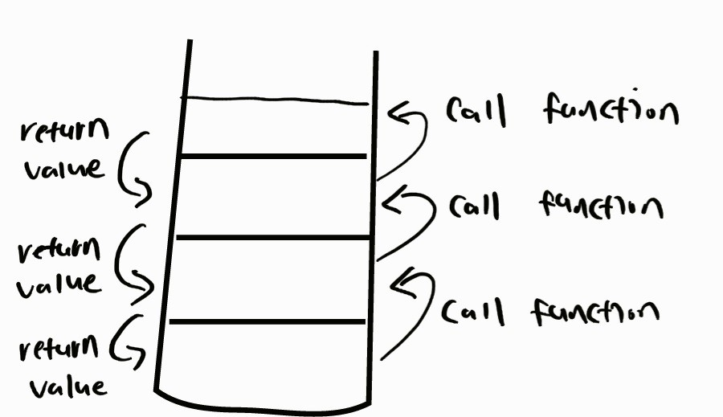
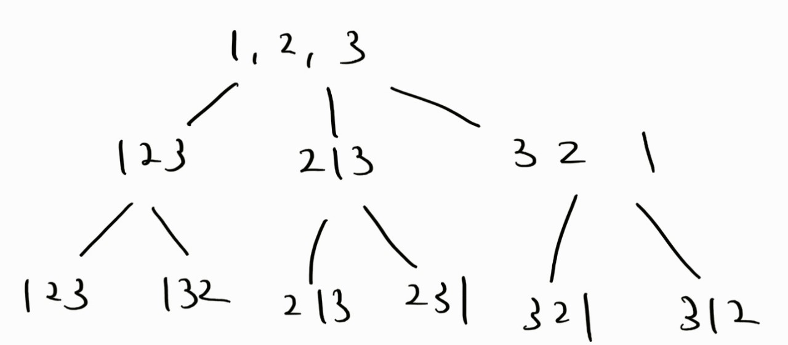
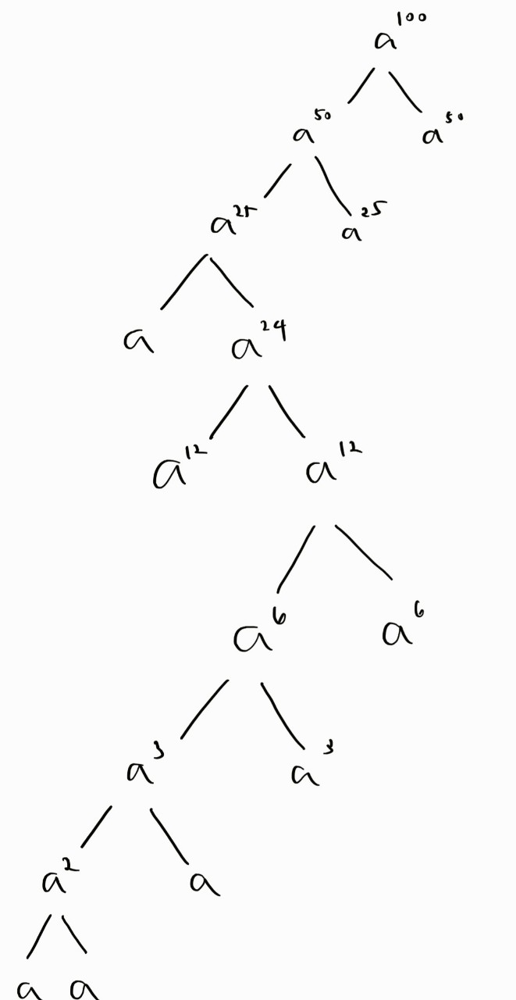

## 재귀

`하나의 함수에서 자기 자신을 다시 호출하여 작업을 수행하는 방식`

### 특징

* 반복문으로 대체가 가능하다. 

*  재귀 함수를 사용하면 변수를 여러개 만들 필요가 없고, 코드가 간결해진다는 장점이 존재.

### 단점

* 시간 복잡도 계산이 어려워짐
* stack이 터지는 경우가 발생할수 있음. 재귀 함수들이 쌓이는 stack 크기를 고려해야함. vs stack의 기본 크기는 1mb

### 순열 알고리즘

~~~
void Permutation(vector<int>& Array, int Start, int End)
{
    if (Start == End)
    {
        for (const auto it : Array)
        {
            cout << it << " ";
        }
        cout << endl;
    }
    else
    {
        for (int i = Start; i <= End; ++i)
        {
            swap(Array[Start], Array[i]);
            Permutation(Array, Start + 1, End);
            swap(Array[Start], Array[i]);
        }
    }
}

~~~

### 풀어볼만한 문제

* [백준 2609번 최대공약수와 최대공배수](https://www.acmicpc.net/problem/2609) 
  ~~~ 
  def gcd(m, n):
    if m < n:
        m, n = n, m
    if m % n == 0:
        return n
    else:
        return gcd(n, m%n)
    print(gcd(48, 60)) # 12 
  ~~~

  * [백준 10830 행렬의 제곱 2](https://www.acmicpc.net/problem/10830)

  

~~~
static int[][] sol(int[][] a1,long num){
        if(num==1L){
            return a1;
        }
        else{
            int[][] arr;
            if(num%2==1L){
                arr = multi(sol(a1, num-1),origin);
            }
            else{
                arr = sol(a1,num/2);
                arr= multi(arr,arr);
            }

            return arr;
        }
    }
~~~
